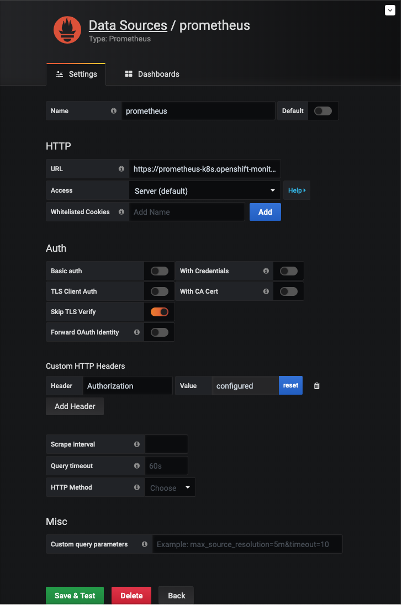
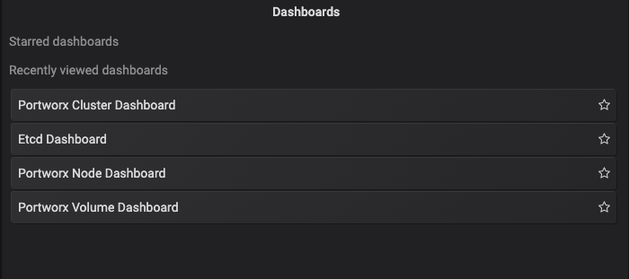

# Enable PX monitoring on OCP4.x Prometheus 

* ## Create service monitor:

   ```
   cat <<EOF | oc apply -f -
   apiVersion: monitoring.coreos.com/v1
   kind: ServiceMonitor
   metadata:
     namespace: openshift-monitoring
     name: portworx-prometheus-sm
     labels:
       k8s-app: portworx
   spec:
     selector:
       matchLabels:
         name: portworx
     namespaceSelector:
     # Namespace where PX is running 
       matchNames:
       - portworx 
     endpoints:
     - port: px-api
   EOF
   ```

* ## For OCP4.4+ create `Role` and `RoleBinding` for prometheus-k8s in the namespace where PX is running.

    ```
    cat <<EOF | oc apply -f -
    apiVersion: rbac.authorization.k8s.io/v1
    kind: Role
    metadata:
      name: prometheus-k8s
      # Namespace where PX is running 
      namespace: portworx
    rules:
    - apiGroups:
      - ""
      resources:
      - services
      - endpoints
      - pods
      verbs:
      - get
      - list
      - watch
    ---
    apiVersion: rbac.authorization.k8s.io/v1
    kind: RoleBinding
    metadata:
      name: prometheus-k8s
      # Namespace where PX is running 
      namespace: portworx
    roleRef:
      apiGroup: rbac.authorization.k8s.io
      kind: Role
      name: prometheus-k8s
    subjects:
    - kind: ServiceAccount
      name: prometheus-k8s
      namespace: openshift-monitoring
    EOF
  
* ## Apply PX rules:

     `oc apply -f px-rules.yaml`

* ## Get Prometheus token and save it, it will be used later on.

     `oc -n openshift-monitoring serviceaccounts get-token  prometheus-k8s`

* ## Install Grafana 

  The Grafana instance that is provided with Openshift monitoring stack is read-only. Any dashboard changes will not be persisted once you exit the dashboard, therefore we will our own Grafana instance to visualize PX monitoring. 

     `oc apply -f grafana-deployment.yaml -n portworx`

* ## Create a route in OCP4.x for the new Grafana
     `oc apply -f grafana-route.yaml -n portworx`
* ## Open Grafana UI and click on Datasource, select Prometheus and under setting change the following:

  - Under HTTP, add Prometheus url. The default url is
__https://<span></span>prometheus-k8s.openshift-monitoring.svc:9091__
  - Under Auth, turn off everything except skip TLS Verify( leave it on).
  - Under Custom HTTP Header, add the token from step 3 above:
    - Header: `Authorization`
    - Value: `Bearer YOUR-Prometheus-TOKEN`

  
  - Click on Save & Test. If any error is found during authentication you will need to fix that before being able to use Grafana.
* ## Click on Dashboard, PX dashboards will be listed there
  
